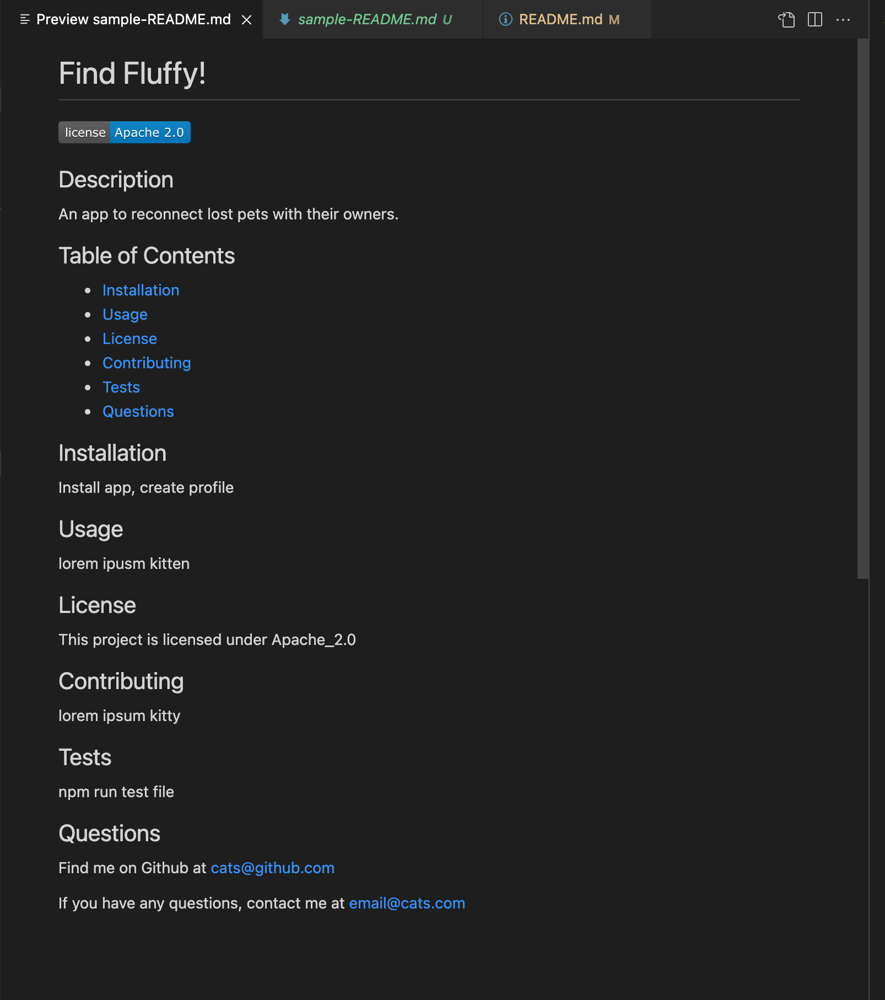

# README.md Generator

## Description

This is a command-line application that will allow the user to generate a README.md file for an application, using Inquirer in Node.js. The user will be prompted for infomation regarding their project and a markdown file will be created, filling a template for a README.md file containing the given information.

## License


## Technologies Used

    * Javascript
    * Node.js
    * Inquirer


## What I Learned

I appreciate the ease of using template literals to structure and print text. I first created a sample README.md file containing all of the headers and content needed, and then could copy and paste each part where it was needed into the code.

I learned the importance and usefulness of documentation for resources like Inquirer. There were many options available for questions - I was easily able to find the best fit for the information I wanted to gather to build a README.

One challege I faced was accidentally pushing up a copy of a generated README file, writing over the README for this repo, because of a mistake in naming the new file in the index.js file. This was fixed by adding "sample-" in front of the new README.md file name.

## Usage

You can run this application by typing the following into your terminal:

```
node index.js
```
And then follow the prompts to enter the content you wish to include in your README.

## README.md Generator Walkthrough

https://watch.screencastify.com/v/8G9C8RZtRK31LQEXhAqh

## URL for GitHub Repo

https://github.com/ChristinaBohn/readme-generator-using-node

## Sample Generated README.md


  